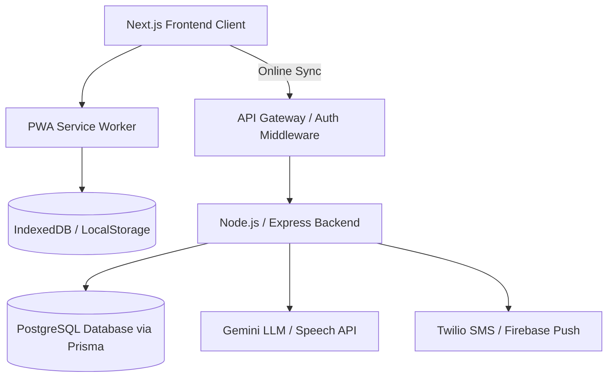

# Product Requirements Document (PRD): MedMind

MedMind is a smart, gamified mobile-first web application designed to optimize medication adherence and bridge the communication gap between patients, their caregivers, and doctors. By combining interactive logging verification, offline durability, voice commands, and AI-powered advice, MedMind provides an accessible, error-proof assistant for health management.

---

## 1. Product Overview

### 1.1 Vision
MedMind aims to solve the widespread issue of medical non-adherence (forgetting doses or accidentally double-dosing). It achieves this via:
- **Aesthetic and responsive tracking** with a dark, high-contrast, glowing UI that reduces cognitive fatigue.
- **Gamified security** (Puzzle Lock) to ensure patients are conscious and deliberate when logging critical doses.
- **Hands-free accessibility** (Voice Control) for users with limited mobility or motor difficulties.
- **Offline-first design** to ensure uninterrupted access in areas with poor internet connection.
- **Collaborative care loops** allowing caregivers to monitor adherence remotely and doctors to examine validated charts.

### 1.2 Target Personas
1. **The Patient (e.g., Ahmed, age 65)**
   - *Needs*: Simple logging interface, high-contrast text, automated reminders, a safeguard against double-dosing when confused, and voice activation for convenience.
   - *Pain Points*: Frequently forgets if he took his morning Metformin, leading to accidental double doses or missed doses. Has poor internet in his kitchen.
2. **The Caregiver (e.g., Sarah, Ahmed's daughter, age 35)**
   - *Needs*: Peace of mind. Real-time notifications if her father misses a critical medication, and quick ways to check his daily status without constantly calling to nag him.
   - *Pain Points*: Worries constantly about her father's medication adherence, but cannot visit daily.
3. **The Healthcare Provider (e.g., Dr. Faisal, Cardiologist)**
   - *Needs*: Reliable compliance charts. Needs to see if medication changes are working based on actual ingestion history rather than self-reported memory.
   - *Pain Points*: Patients frequently report perfect adherence, but blood work suggests otherwise.

---

## 2. Technical Architecture & System Design



### 2.1 Technical Stack
- **Frontend**: Next.js 14 (App Router), Tailwind CSS (for custom dark/neon gradients and responsive sizing), Lucide React (for uniform iconography), and Recharts (for telemetry-style compliance charts).
- **Local Cache**: Service Workers + IndexedDB (for storing offline actions and queueing sync requests).
- **Backend (Proposed)**: Node.js / Express API server with PostgreSQL and Prisma ORM.
- **AI Services**: Gemini API (for contextual medical Q&A and semantic voice parsing).
- **Integrations**: Twilio (for caregiver SMS alerts) and FCM (Firebase Cloud Messaging) for push reminders.

---

## 3. Database Schema Proposal (Prisma Schema DSL)

```prisma
datasource db {
  provider = "postgresql"
  url      = env("DATABASE_URL")
}

generator client {
  provider = "prisma-client-js"
}

enum Role {
  PATIENT
  CAREGIVER
  DOCTOR
}

enum SyncStatus {
  PENDING
  SYNCED
  FAILED
}

enum DoseStatus {
  TAKEN
  MISSED
  SKIPPED
  UPCOMING
}

model User {
  id            String    @id @default(uuid())
  email         String    @unique
  passwordHash  String
  name          String
  role          Role      @default(PATIENT)
  createdAt     DateTime  @default(now())
  updatedAt     DateTime  @updatedAt

  // Patient Relationships
  medications   Medication[]
  doseLogs      DoseLog[]
  
  // Caregiver Relationships
  caregivers    CaregiverPatient[] @relation("PatientRelation")
  patients      CaregiverPatient[] @relation("CaregiverRelation")
  
  // Doctor Relationships
  doctors       DoctorPatient[]    @relation("PatientDoctorRelation")
  doctorFiles   DoctorPatient[]    @relation("DoctorRelation")
}

model CaregiverPatient {
  id          String   @id @default(uuid())
  caregiverId String
  patientId   String
  caregiver   User     @relation("CaregiverRelation", fields: [caregiverId], references: [id])
  patient     User     @relation("PatientRelation", fields: [patientId], references: [id])
  createdAt   DateTime @default(now())

  @@unique([caregiverId, patientId])
}

model DoctorPatient {
  id        String   @id @default(uuid())
  doctorId  String
  patientId String
  doctor    User     @relation("DoctorRelation", fields: [doctorId], references: [id])
  patient   User     @relation("PatientDoctorRelation", fields: [patientId], references: [id])
  createdAt DateTime @default(now())

  @@unique([doctorId, patientId])
}

model Medication {
  id           String      @id @default(uuid())
  patientId    String
  patient      User        @relation(fields: [patientId], references: [id])
  name         String
  dosage       String      // e.g. "500mg" or "1 tablet"
  timeOfDay    String      // e.g. "08:00" (stored as HH:MM)
  requiresLock Boolean     @default(false) // If true, triggers the Math Puzzle Lock
  createdAt    DateTime    @default(now())
  updatedAt    DateTime    @updatedAt
  doseLogs     DoseLog[]
}

model DoseLog {
  id           String     @id @default(uuid())
  patientId    String
  patient      User       @relation(fields: [patientId], references: [id])
  medicationId String
  medication   Medication @relation(fields: [medicationId], references: [id])
  scheduledTime DateTime
  loggedTime   DateTime?
  status       DoseStatus @default(UPCOMING)
  syncStatus   SyncStatus @default(SYNCED)
  deviceUUID   String?
  createdAt    DateTime   @default(now())
}
```

---

## 4. Detailed Functional Requirements (Screen by Screen)

### 4.1 Main Patient Dashboard (`/`)
- **Objective**: Serve as the core command center displaying today's progress, upcoming doses, and habits.
- **UI Elements**:
  - Greeting header with notifications trigger.
  - SVG Adherence Ring tracking daily compliance (`(taken doses / total due doses) * 100`).
  - Streak Counter (🔥) calculating consecutive days of 100% compliance.
  - Interactive "Today's Schedule" displaying status badges (`✓ TAKEN`, `⚡ DUE SOON`, `UPCOMING`).
  - Quick action "LOG DOSE" button which updates the status and redraws the progress ring.
  - Hydration card tracking daily water intake with active add buttons (+250ml).
- **Backend Sync Logic**: 
  - On page load, fetch the patient's local schedule.
  - Calculate adherence metrics client-side to ensure immediate render.
  - Update the daily log table on the database in real-time when connected.

### 4.2 Puzzle Lock Screen (`/puzzle-lock`)
- **Objective**: Prevent accidental double-dosing or mindless tapping of high-risk medication logs.
- **UI Elements**:
  - Clear display of the medication being confirmed.
  - Math formula display (e.g., `5 + 2 = ?`) generated dynamically.
  - Clean custom grid keypad (`1-9`, `0`, `Clear`).
  - "Confirm Taken" CTA disabled until correct solution is entered.
- **Logic**:
  - The medication registry dictates whether a medication `requiresLock`.
  - When the user taps "Log Dose" for a locked medication, they are redirected to `/puzzle-lock?medId=xyz`.
  - On correct input, the dose is successfully logged, local storage is updated, and the user is redirected back to the dashboard.

### 4.3 Voice Control Center (`/voice-control`)
- **Objective**: Enable hands-free dose logging and system queries.
- **UI Elements**:
  - Glowing, pulsing speech-activation orb representing microphone state.
  - Conversation feed detailing transcription matches (e.g., *"Ahmed: I just took my Lipitor"*, *"AI Assistant: Logged Lipitor 20mg at 8:15 AM"*).
  - Chip suggestions indicating format requirements (e.g., `"Log my Metformin"`, `"What's next?"`).
- **Processing Flow**:
  - Web Speech API listens and outputs rough transcription.
  - Local client checks transcription text against scheduled medications (e.g., if text matches "Metformin", prompt confirmation).
  - Online backend uses an LLM (Gemini API) to process natural language intents (e.g. *"I took my heart pill" -> resolves to Lisinopril*).

### 4.4 Offline Mode Sync (`/offline`)
- **Objective**: Protect data consistency in remote or disconnected environments.
- **UI Elements**:
  - Amber warning banner showing "OFFLINE MODE ENABLED".
  - List of actions queued locally with timestamps.
  - Storage consumption indicator.
  - "Force Sync Attempt" control button.
- **Sync Logic**:
  - Service Worker listens to `fetch` events. If network drops, logs are saved in IndexedDB and sync status set to `PENDING`.
  - When connection is restored (`window.addEventListener('online')`), the queue is read.
  - **Conflict Resolution**: If a log is synced late, the server resolves conflicts by comparing `scheduledTime` and client-generated `loggedTime` to prevent duplicates.

### 4.5 Caregiver Portal (`/caregiver`)
- **Objective**: Keep remote caregivers informed and enable immediate action.
- **UI Elements**:
  - Patient health status telemetry (Sarah's status, weekly adherence rate, active streaks).
  - Red Alarm alerts for missed critical medications (e.g., *"Missed: Insulin 10 units at 7:00 AM"*).
  - Communication hotkeys ("Call Sarah", "Send WhatsApp").
- **Backend Flow**:
  - If a DoseLog status changes to `MISSED` (computed when `currentTime > scheduledTime + 1 hour` and `status != TAKEN`), the server triggers a background worker.
  - A SMS alert is sent via Twilio/FCM to the registered caregiver's phone.

### 4.6 Doctor Report Screen (`/doctor-report`)
- **Objective**: Synthesize adherence logs into professional metrics.
- **UI Elements**:
  - Responsive Recharts Bar Chart showing adherence percentage by week day.
  - Medication-specific adherence score cards (e.g., *Atorvastatin: 94%*, *Metformin: 85%*).
  - "Export Report as PDF" trigger.
- **Reporting Engine**:
  - Generates PDF templates containing data grids, chart snapshots, and notes fields.
  - Exports directly on client-side for rapid sharing via email or medical portals.

### 4.7 AI Medical Assistant (`/qna`)
- **Objective**: Provide reliable context-aware guidance for medication inquiries.
- **UI Elements**:
  - Responsive chat conversation layout.
  - Dynamic query chips (e.g., *"Side Effects?"*, *"Interactions?"*, *"Missed Dose?"*).
  - Input field with standard send controls.
- **AI Agent Integration**:
  - Employs a Retrieval-Augmented Generation (RAG) system mapping the user's active prescriptions.
  - Passes user context to Gemini API with strict system guidelines: *"You are MedMind AI. Answer questions concisely based on official medical documents. Recommend consulting a pharmacist or doctor for serious anomalies."*

---

## 5. Non-Functional & Security Requirements

### 5.1 HIPAA & Medical Privacy Compliance
- **Data Encryption**: All database columns containing Patient Health Information (PHI) like medication names, dosages, and schedules must be encrypted at rest using AES-256.
- **Secure Transport**: Strict HTTPS / TLS 1.3 enforced for all APIs.
- **Consent Logs**: Patients must explicitly authorize caregiver connection requests inside the profile manager. Caregivers can be revoked instantly.

### 5.2 Performance SLA
- **Local Load Speed**: Core dashboard should boot within **<1.5 seconds** on LTE networks using Next.js Static Site Generation (SSG) for static templates and client-side hydration for dynamic logs.
- **Sync Reliability**: Sync engine must handle back-pressure if a user goes offline for multiple weeks, processing up to 100 offline logs sequentially.

---

## 6. Implementation Roadmap

### Phase 1: High-Fidelity UI Prototype (Completed)
- Next.js codebase structured under `app/` App Router.
- Tailwind dark navy & neon glow styling system configured in `globals.css`.
- Dummy React states controlling hydration, charts, chatting, and puzzle inputs.

### Phase 2: Full-Stack Integration & Storage (Next)
- Setup PostgreSQL DB and Prisma Schema on Node/Express backend.
- Connect Next.js fetch queries to REST endpoints for dashboard, schedules, and logs.
- Implement IndexedDB local queue logic to handle the `/offline` synchronization stream.
- Enable user authentication (NextAuth.js or JWT-based auth).

### Phase 3: AI Assistant & Notification Gateways
- Integrate Gemini API for semantic voice processing and conversational Q&A.
- Configure Twilio microservices for caregiver SMS dispatching on missed doses.
- Add client service worker push notifications for standard patient alarms.
